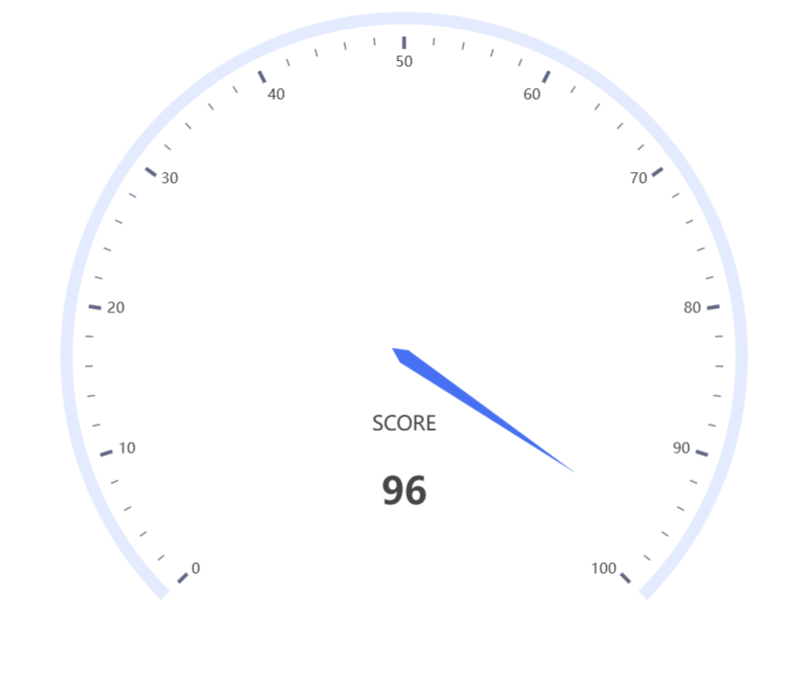
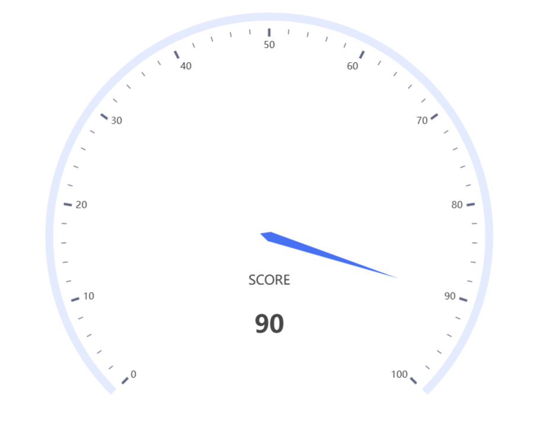

## 仪表盘

### 基础仪表盘

```html
<html lang="en">
<head>
    <meta charset="UTF-8">
    <title>基础仪表盘</title>

    <script type="text/javascript" src="./js/echarts.js"></script>
    <script type="text/javascript" src="js/axios.js"></script>
</head>

<style>
    #container {
        width: 70vw;
        height: 70vh;
        position: absolute;
        top: 50%;
        left: 50%;
        transform: translate(-50%, -50%);
    }
</style>
<body>
<div id="container"></div>
<script>

    //初始化echarts实例
    var chart = echarts.init(document.getElementById('container'));

    // 指定图表的配置项和数据
    var option =
        {
            tooltip: {
                formatter: '{a} <br/>{b} : {c}%'
            },
            series: [
                {
                    name: '仪表盘',
                    type: 'gauge',
                    detail: {
                        formatter: '{value}'
                    },
                    data: [
                        {
                            value: 50,
                            name: 'SCORE'
                        }
                    ]
                }
            ]
        };

    //使用刚指定的配置项和数据显示图表
    chart.setOption(option);

    setInterval(function ()
    {
        chart.setOption(
            {
                series: [
                    {
                        data: [
                            {
                                name: 'SCORE',
                                value: (function ()
                                {
                                    return Math.round(Math.random() * 100)
                                }())
                            }
                        ]
                    }
                ]
            }
        )
    }, 2000)
</script>

</body>
</html>
```





### 带标签数字动画的基础仪表盘

```html
<html lang="en">
<head>
    <meta charset="UTF-8">
    <title>带标签数字动画的基础仪表盘</title>

    <script type="text/javascript" src="./js/echarts.js"></script>
    <script type="text/javascript" src="js/axios.js"></script>
</head>

<style>
    #container {
        width: 70vw;
        height: 70vh;
        position: absolute;
        top: 50%;
        left: 50%;
        transform: translate(-50%, -50%);
    }
</style>
<body>
<div id="container"></div>
<script>

    //初始化echarts实例
    var chart = echarts.init(document.getElementById('container'));

    // 指定图表的配置项和数据
    var option =
        {
            tooltip: {
                formatter: '{a} <br/>{b} : {c}%'
            },
            series: [
                {
                    name: '仪表盘',
                    type: 'gauge',
                    detail: {
                        valueAnimation: true,
                        formatter: '{value}'
                    },
                    data: [
                        {
                            value: 50,
                            name: 'SCORE'
                        }
                    ]
                }
            ]
        };

    //使用刚指定的配置项和数据显示图表
    chart.setOption(option);

    setInterval(function ()
    {
        chart.setOption(
            {
                series: [
                    {
                        data: [
                            {
                                name: 'SCORE',
                                value: (function ()
                                {
                                    return Math.round(Math.random() * 100)
                                }())
                            }
                        ]
                    }
                ]
            }
        )
    }, 2000)
</script>

</body>
</html>
```





### 速度仪表盘

```html
<html lang="en">
<head>
    <meta charset="UTF-8">
    <title>速度仪表盘</title>

    <script type="text/javascript" src="./js/echarts.js"></script>
    <script type="text/javascript" src="js/axios.js"></script>
</head>

<style>
    #container {
        width: 70vw;
        height: 70vh;
        position: absolute;
        top: 50%;
        left: 50%;
        transform: translate(-50%, -50%);
    }
</style>
<body>
<div id="container"></div>
<script>

    //初始化echarts实例
    var chart = echarts.init(document.getElementById('container'));

    // 指定图表的配置项和数据
    var option =
        {
            series: [
                {
                    name: '仪表盘',
                    type: 'gauge',
                    progress: {
                        show: true,
                        width: 18
                    },
                    axisLine: {
                        lineStyle: {
                            width: 18
                        }
                    },
                    axisTick: {
                        show: false
                    },
                    splitLine: {
                        length: 15,
                        lineStyle: {
                            width: 2,
                            color: '#999'
                        }
                    },
                    axisLabel: {
                        distance: 25,
                        color: '#999',
                        fontSize: 20
                    },
                    anchor: {
                        show: true,
                        showAbove: true,
                        size: 25,
                        itemStyle: {
                            borderWidth: 10
                        }
                    },
                    title: {
                        show: false
                    },
                    detail: {
                        valueAnimation: true,
                        fontSize: 80,
                        offsetCenter: [0, '70%']
                    },
                    data: [
                        {
                            value: 50,
                            name: '速度'
                        }
                    ]
                }
            ]
        };

    //使用刚指定的配置项和数据显示图表
    chart.setOption(option);

    var data = 50;

    setInterval(function ()
    {
        chart.setOption(
            {
                series: [
                    {
                        data: [
                            {
                                name: '速度',
                                value: (function ()
                                {
                                    if (data >= 100)
                                    {
                                        return 99;
                                    }
                                    if (data <= 0)
                                    {
                                        return 1;
                                    }
                                    return Math.random() > 0.5 ? (++data) : (--data);
                                }())
                            }
                        ]
                    }
                ]
            }
        )
    }, 500)
</script>

</body>
</html>
```


### 阶段速度仪表盘

```html
<html lang="en">
<head>
    <meta charset="UTF-8">
    <title>阶段速度仪表盘</title>

    <script type="text/javascript" src="./js/echarts.js"></script>
    <script type="text/javascript" src="js/axios.js"></script>
</head>

<style>
    #container {
        width: 70vw;
        height: 70vh;
        position: absolute;
        top: 50%;
        left: 50%;
        transform: translate(-50%, -50%);
    }
</style>
<body>
<div id="container"></div>
<script>

    //初始化echarts实例
    var chart = echarts.init(document.getElementById('container'));

    // 指定图表的配置项和数据
    var option =
        {
            series: [
                {
                    name: '仪表盘',
                    type: 'gauge',
                    axisLine: {
                        lineStyle: {
                            width: 30,
                            color: [
                                [0.3, 'green'],
                                [0.6, '#37a2da'],
                                [0.8, '#ffaa00'],
                                [1, '#fd666d']
                            ]
                        }
                    },
                    pointer: {
                        itemStyle: {
                            color: 'inherit'
                        }
                    },
                    axisTick: {
                        distance: -30,
                        length: 8,
                        lineStyle: {
                            color: '#fff',
                            width: 2
                        }
                    },
                    splitLine: {
                        distance: -30,
                        length: 30,
                        lineStyle: {
                            color: '#fff',
                            width: 4
                        }
                    },
                    axisLabel: {
                        color: 'inherit',
                        distance: 40,
                        fontSize: 20
                    },
                    detail: {
                        valueAnimation: true,
                        formatter: '{value} km/h',
                        color: 'inherit'
                    },
                    data: [
                        {
                            value: 50,
                            name: '速度'
                        }
                    ]
                }
            ]
        };

    //使用刚指定的配置项和数据显示图表
    chart.setOption(option);

    var data = 50;

    setInterval(function ()
    {
        chart.setOption(
            {
                series: [
                    {
                        data: [
                            {
                                name: '速度',
                                value: (function ()
                                {
                                    if (data >= 100)
                                    {
                                        return 99;
                                    }
                                    if (data <= 0)
                                    {
                                        return 1;
                                    }
                                    return Math.random() > 0.5 ? (++data) : (--data);
                                }())
                            }
                        ]
                    }
                ]
            }
        )
    }, 500)
</script>

</body>
</html>
```


### 多标题仪表盘

```html
<html lang="en">
<head>
    <meta charset="UTF-8">
    <title>多标题仪表盘</title>

    <script type="text/javascript" src="./js/echarts.js"></script>
    <script type="text/javascript" src="js/axios.js"></script>
</head>

<style>
    #container {
        width: 70vw;
        height: 70vh;
        position: absolute;
        top: 50%;
        left: 50%;
        transform: translate(-50%, -50%);
    }
</style>
<body>
<div id="container"></div>
<script>

    //初始化echarts实例
    var chart = echarts.init(document.getElementById('container'));


    function getGaugeData()
    {
        return [
            {
                value: (function ()
                {
                    return (Math.random() * 100).toFixed(2)
                }()),
                name: 'CPU使用率',
                title: {
                    offsetCenter: ['-40%', '80%']
                },
                detail: {
                    offsetCenter: ['-40%', '95%']
                }
            },
            {
                value: (function ()
                {
                    return (Math.random() * 100).toFixed(2)
                }()),
                name: '内存使用率',
                title: {
                    offsetCenter: ['0%', '80%']
                },
                detail: {
                    offsetCenter: ['0%', '95%']
                }
            },
            {
                value: (function ()
                {
                    return (Math.random() * 100).toFixed(2)
                }()),
                name: 'GPU使用率',
                title: {
                    offsetCenter: ['40%', '80%']
                },
                detail: {
                    offsetCenter: ['40%', '95%']
                }
            }
        ];
    }

    // 指定图表的配置项和数据
    var option =
        {
            series: [
                {
                    type: 'gauge',
                    anchor: {
                        show: true,
                        showAbove: true,
                        size: 18,
                        itemStyle: {
                            color: '#FAC858'
                        }
                    },
                    pointer: {
                        icon: 'path://M2.9,0.7L2.9,0.7c1.4,0,2.6,1.2,2.6,2.6v115c0,1.4-1.2,2.6-2.6,2.6l0,0c-1.4,0-2.6-1.2-2.6-2.6V3.3C0.3,1.9,1.4,0.7,2.9,0.7z',
                        width: 8,
                        length: '80%',
                        offsetCenter: [0, '8%']
                    },
                    progress: {
                        show: true,
                        overlap: true,
                        roundCap: true
                    },
                    axisLine: {
                        roundCap: true
                    },
                    data: getGaugeData(),
                    title: {
                        fontSize: 14
                    },
                    detail: {
                        width: 40,
                        height: 14,
                        fontSize: 14,
                        color: '#fff',
                        backgroundColor: 'inherit',
                        borderRadius: 3,
                        formatter: '{value}%'
                    }
                }
            ]
        };

    //使用刚指定的配置项和数据显示图表
    chart.setOption(option);


    setInterval(function ()
    {
        chart.setOption(
            {
                series: [
                    {
                        data: getGaugeData()
                    }
                ]
            }
        )
    }, 2000)
</script>

</body>
</html>
```


